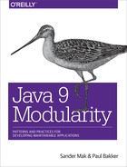

# 目录

- [第一部分 Java 模块系统介绍](./part1.md)
- [第 1 章 模块化概述](./ch1.md)
- [第 2 章 模块化和模块化 JDK](./ch2.md)
- [第 3 章 使用模块](./ch3.md)
- [第 4 章 服务](./ch4.md)
- [第 5 章 模块化模式](./ch5.md)
- [第 6 章 高级模块化模式](./ch6.md)
- [第二部分 迁移](./part3.md)
- [第 7 章 没有模块的迁移](./ch7.md)
- [第 8 章 迁移到模块](./ch8.md)
- [第 9 章 迁移案例研究：Spring 和 Hibernate](./ch9.md)
- [第 10 章 库迁移](./ch10.md)
- [第三部分 模块化开发工具](./part4.md)
- [第 11 章 构建工具和 IDE](./ch11.md)
- [第 12 章 测试模块](./c12.md)
- [第 13 章 使用自定义运行时映像进行缩减](./ch13.md)
- [第 14 章 模块化的未来](./ch14.md)
